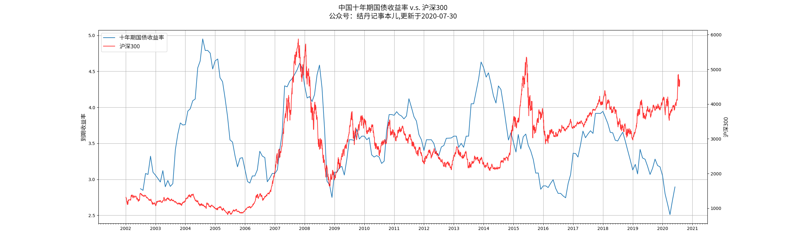

主要监控宏观指标，有很强的趋势性，在关键点位突破后趋势一般不可阻挡，需要及时调整自己的仓位。

### A股全市场等权重PE分位

**数据来源：集思录**

 
    <iframe id="frame" scrolling="no" src="https://www.jisilu.cn/data/indicator/" style="border: 0; position: relative; top:-140px; float:left; left:-40px; height: 1150px; width: 1300px; -ms-zoom: 0.76; -moz-transform: scale(0.76); -moz-transform-origin: 0 0; -o-transform: scale(0.76); -o-transform-origin: 0 0; -webkit-transform: scale(0.76); -webkit-transform-origin: 0 0;"> 
    </iframe> 

### 中国十年期国债收益率

### 美联储利率周期
### 中国GDP数据
### 中国M2货币
### 美联储负债表
### 美国公司债务
### 各国央行黄金存储总量
### A股交易总额
### A股市值和GDP比值
### 主要行业PE分位对比图
### 行业PE-TTM/PB数据下载
