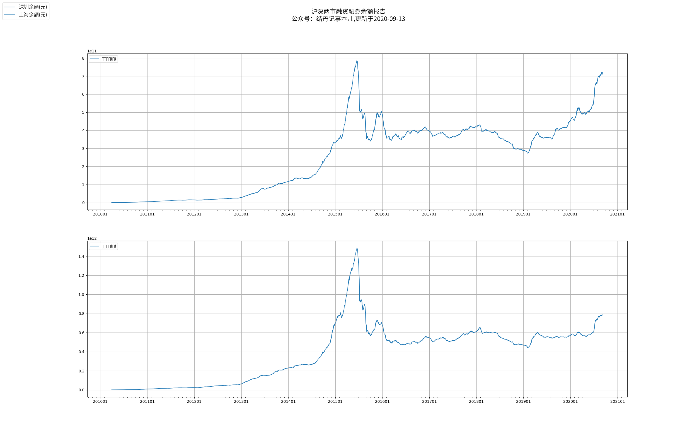
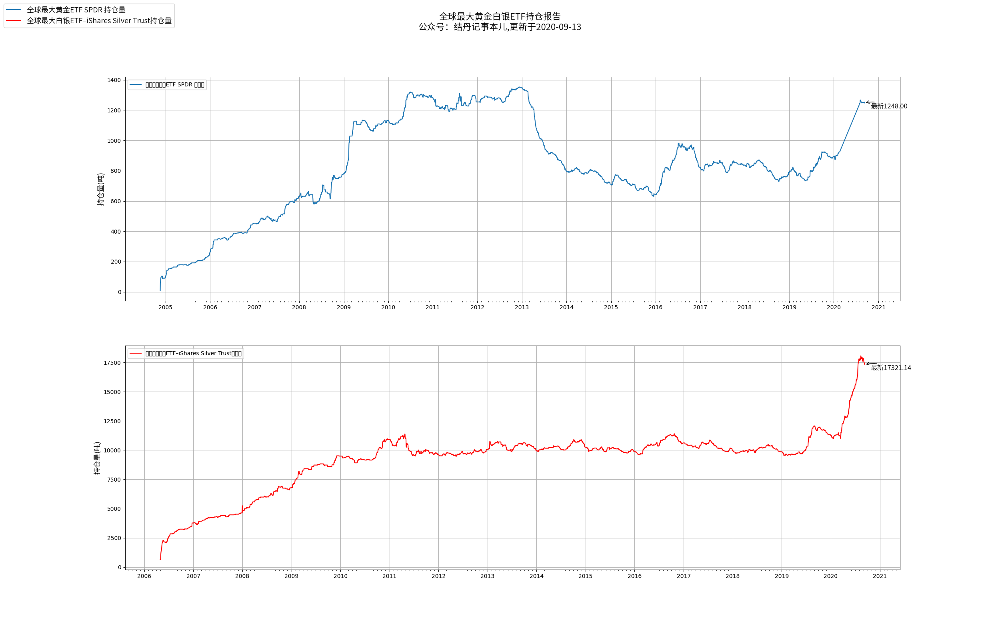
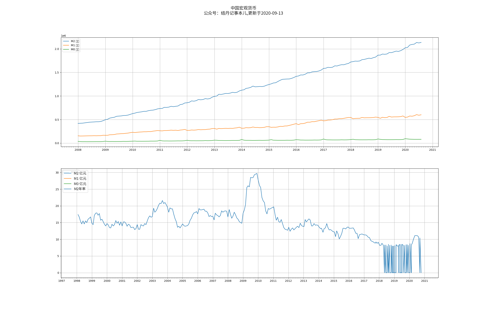

> 主要监控宏观指标，把握资产轮动的主脉络

### A股全市场等权重PE分位

**数据来源：集思录**

 
    <iframe id="frame" scrolling="no" src="https://www.jisilu.cn/data/indicator/" style="border: 0; position: relative; top:-140px; float:right; left: 340px; height: 1150px; width: 1300px; -ms-zoom: 0.76; -moz-transform: scale(0.76); -moz-transform-origin: 0 0; -o-transform: scale(0.76); -o-transform-origin: 0 0; -webkit-transform: scale(0.76); -webkit-transform-origin: 0 0; overflow:hidden;"> 
    </iframe> 

### 沪深两市融资余额

### 中国十年期国债收益率

### 中国GDP数据

### 全球最大贵金属ETF基金持仓报告

### 各国央行黄金存储总量

### 中国M2货币

### VIX 恐慌指数（标普波动率指数）
https://cn.investing.com/indices/volatility-s-p-500-historical-data

### 美联储利率周期
https://fred.stlouisfed.org/series/DGS10/?utm_source=fred-glance-widget&utm_medium=widget&utm_campaign=fred-glance-widget#0

### 美联储负债表
https://fred.stlouisfed.org/series/WALCL

### 美国公司债务
https://fred.stlouisfed.org/series/ASTDSL
https://fred.stlouisfed.org/series/FGTSL
https://fred.stlouisfed.org/series/ASCFBL

### A股交易总额
stock_sse_summary_df = ak.stock_sse_summary()

### A股市值和GDP比值
stock_sse_summary_df = ak.stock_sse_summary()
/
GDP

### 主要行业PE分位对比图
1. 中证全指
2. 沪深300
3. 医药
4. 传媒
5. 环保
6. 通信
7. 科技
8. 证券
9. 银行
10. 基建
11. 保险
12. 可选消费
13. 必选消费
14. ... ...

### 行业PE-TTM/PB数据下载
[TODO] 下载链接
